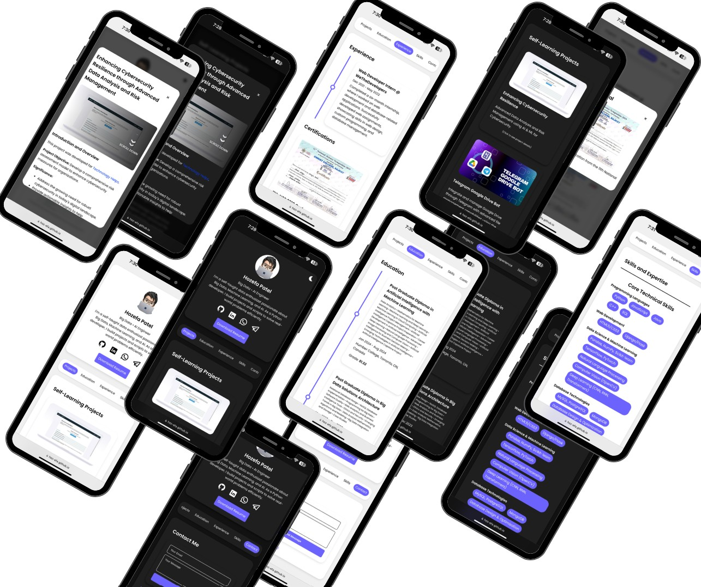
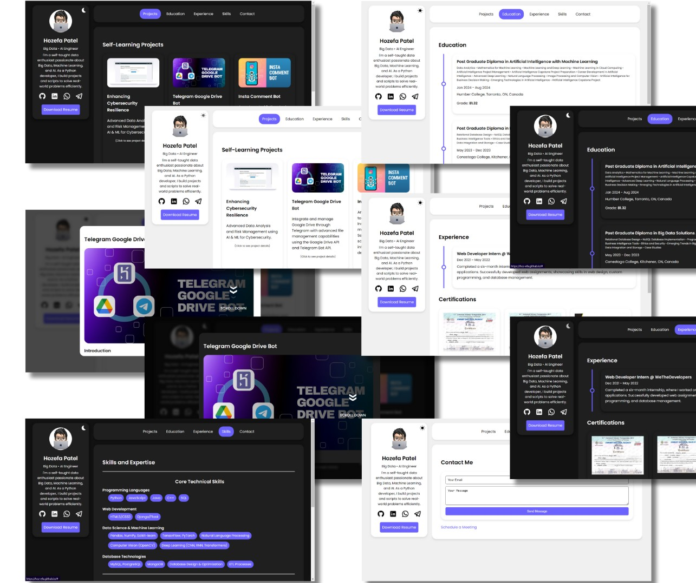

# Portfolio Website

Welcome to the repository for my personal portfolio website. This website showcases my projects, skills, education, and experience as a Big Data and AI Engineer. Built from scratch, it provides visitors with an interactive and dynamic platform to learn more about me and my work.

---

## Live Demo

Check out the live demo of the website:

🔗 **[hoz-efa.github.io](https://hoz-efa.github.io)**




---

## Table of Contents

- [Features](#features)
- [Technologies Used](#technologies-used)
- [Installation and Setup](#installation-and-setup)
- [Usage](#usage)
- [Project Structure](#project-structure)
- [Credits](#credits)
- [License](#license)

---

## Features

- **Responsive Design**: The website is fully responsive and adapts to various screen sizes, providing an optimal viewing experience on desktops, tablets, and mobile devices.

- **Consistent Project Card Layout**: Implemented an enhanced projects grid that maintains consistent card sizes and layout, regardless of the number of projects displayed. This ensures a uniform and professional appearance when filtering projects by category on all devices.

- **Dynamic Content Loading**: Uses JavaScript to dynamically load content for different sections like Projects, Education, Experience, Skills, and Contact without reloading the page.

- **Theme Toggle**: Includes a light/dark theme toggle button, allowing users to switch between light and dark modes. The theme preference is stored in `localStorage`.

- **Project Categorization and Filtering**: Allows visitors to filter projects by categories using intuitive buttons. This dynamic filtering ensures users can easily find projects of interest, and the projects grid maintains consistent card sizes and layout regardless of the number of projects displayed.

- **Interactive Projects Section**: Showcases my self-learning projects with detailed descriptions, images, and technologies used. Clicking on a project card opens a modal with in-depth information.

- **Experience and Certifications**: Lists my professional experience and certifications with timelines and modal pop-ups for detailed views.

- **Skills Overview**: Displays my technical and professional skills categorized for easy navigation.

- **Contact Form**: This features a contact form powered by [Web3Forms](https://web3forms.com/) that allows users to send me messages directly from the website.

- **Social Media Integration**: Includes links to my GitHub, LinkedIn, WhatsApp, and Telegram profiles for easy connection.

- **Accessibility**: Follows best practices for accessibility, including ARIA labels and keyboard navigation support.

---

## Technologies Used
- **Frontend**:
  - HTML5
  - CSS3
  - JavaScript (ES6+)
  - Responsive Web Design Techniques

- **Libraries and Frameworks**:
  - [Plotly.js](https://plotly.com/javascript/) for interactive charts (in projects)
  - [Web3Forms](https://web3forms.com/) for handling contact form submissions

- **Fonts and Icons**:
  - Google Fonts (`Poppins`)
  - Custom SVG Icons for social media links
  - Font Awesome (commented out but can be enabled)

- **Tools and Utilities**:
  - Local Storage for theme preference
  - Media Queries for responsiveness
  - CSS Variables for theming
  - Flexbox and Grid for layout
  - Open Props for easing functions (imported in CSS)

---

## Installation and Setup

To run this project locally, follow these steps:

1. **Clone the Repository**:
   ```bash
   git clone https://github.com/hoz-efa/portfolio-website.git
   ```

2. **Navigate to the Project Directory**:
   ```bash
   cd portfolio-website
   ```

3. **Open `index.html` in Your Browser**:
   - You can open the `index.html` file in your preferred web browser.
   - Alternatively, you can use a local web server for a better experience:
     ```bash
     # For Python 3.x
     python -m http.server 8000
     # Then visit http://localhost:8000 in your browser
     ```

---

## Usage

- **Navigation**:
  - The top navigation bar includes links to different sections: Projects, Education, Experience, Skills, and Contact.
  - Clicking on these links dynamically loads the content in the main content area without reloading the page.

- **Theme Toggle**:
  - Click the sidebar's theme toggle button (sun and moon icon) to switch between light and dark modes.
  - The selected theme is saved and applied on subsequent visits.

- **Viewing Projects**:
    - In the Projects section, you can **filter projects by categories** using the category buttons located at the top of the section.
    - Clicking on a category button dynamically updates the projects grid to display only the projects that belong to that category.
    - The projects grid maintains consistent card sizes and layout regardless of the number of projects displayed or the device being used.
    - Click on any project card to open a modal with detailed information about the project.
    - The modal includes images, descriptions, technologies used, and links to live demos or repositories.


- **Experience and Certifications**:
  - The Experience section includes a timeline of my work history.
  - Certifications are displayed in a grid; clicking on a certification opens a modal with more details.

- **Skills Section**:
  - Skills are categorized into Core Technical Skills, Cloud & Development Tools, and Professional Skills.
  - Each category lists relevant skills with tags for easy identification.

- **Contact Form**:
  - The Contact section includes a form to send me a message directly.
  - Fill in your email and message, then click "Send Message".
  - A popup will confirm if the message was sent successfully.

- **Download Resume**:
  - Click the "Download Resume" button in the sidebar to download my resume in PDF format.

---

## Project Structure

```
portfolio-website/
├── index.html
├── style.css
├── script.js
├── assets/
│   ├── images/
│   │   ├── profile.jpeg
│   │   ├── favicon.png
│   │   ├── projects/
│   │   │   ├── p1/
│   │   │   │   └── cybersecurity.jpg
│   │   │   ├── p2/
│   │   │   │   └── sentiment_analysis.png
│   │   │   ├── ... (other project images)
│   │   ├── certifications/
│   │   │   ├── cert1.jpg
│   │   │   ├── ... (other certification images)
│   ├── Hozefa Patel - Resume.pdf
```

- **index.html**: The main HTML file containing the webpage's structure, including the sidebar, navigation, and main content area.
- **style.css**: Contains all the styles for the website, including responsive design, theming, and animations.
- **script.js**: Handles dynamic content loading, theme toggling, modal functionality, form submission, and other interactive features.
- **assets/**: Contains images for the profile picture, projects, certifications, and other media, as well as the resume PDF.

---

## Credits

- **Profile Picture**: Personal photograph.
- **Project Images**: Relevant images representing each project.
- **Icons**:
  - SVG icons for social media links sourced and customized.
  - Theme toggle icon inspired by the common sun and moon designs.
- **Fonts**: [Google Fonts - Poppins](https://fonts.google.com/specimen/Poppins)
- **Libraries**:
  - [Plotly.js](https://plotly.com/javascript/) for data visualization in project modals.
  - [Web3Forms](https://web3forms.com/) for contact form handling.
- **Inspiration**: Design inspired by modern portfolio websites emphasizing simplicity and usability.
  - [Angel Martínez's Portfolio](https://github.com/angelmtztrc/portfolio): Inspired by the clean design and user experience.
  - [VCard Personal Portfolio by CodeWithSadee](https://github.com/codewithsadee/vcard-personal-portfolio): Also, found this repository (after I made everything 😢) with a similar design.

---

## License

This project is licensed under the MIT License - see the [LICENSE](LICENSE) file for details.

---

## Contact

Feel free to reach out to me through any of the following channels:

- **Email**: [hozefapatel1999@gmail.com](mailto:hozefapatel1999@gmail.com)
- **LinkedIn**: [linkedin.com/in/hozefa-patel](https://linkedin.com/in/hozefa-patel)
- **Telegram**: [t.me/max_parker](https://t.me/max_parker)

---

Thank you for visiting my portfolio website repository. If you have any suggestions or feedback, please feel free to open an issue or submit a pull request.
